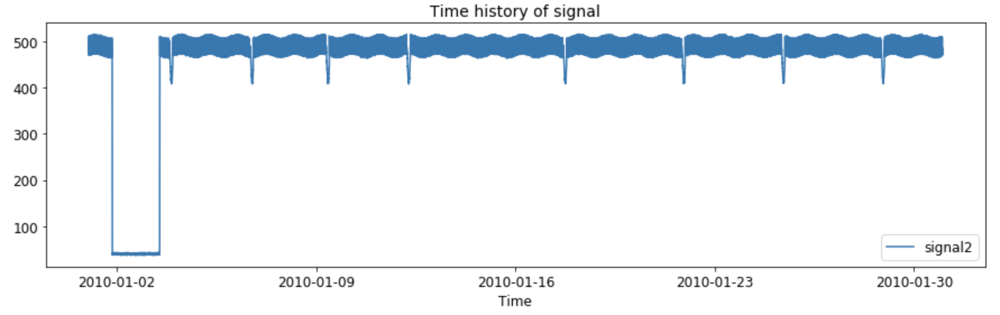
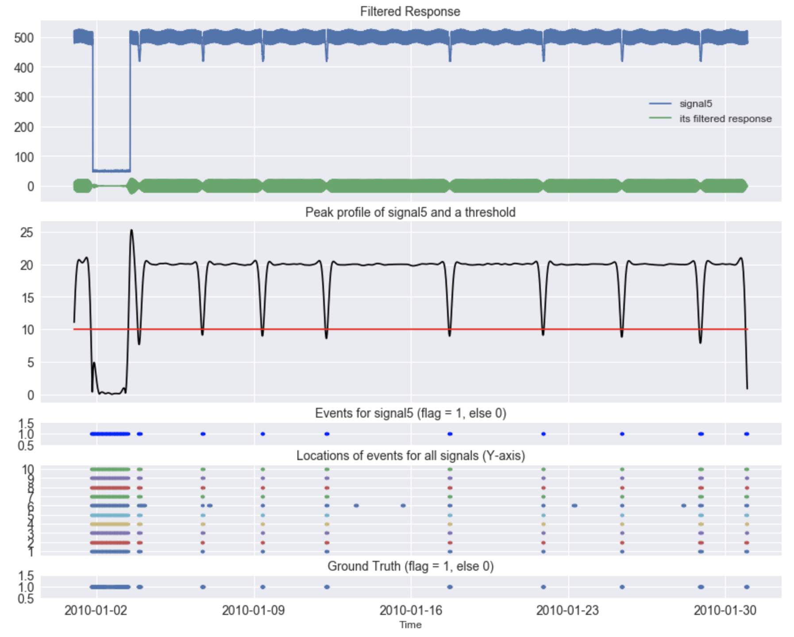

# Anomaly Detection in Time Series Data

This package provides anomaly detection technique in time series data where data comprises of signals of same kind. This technique finds patterns in the data that do not exhibit expected behavior. A wide range of applications can use this technique, for example, system health monitoring for machine operations, fraud detection in credit card transactions, health care, cyber-security etc. For demonstration purpose, we present anomaly detection in time series data that simulates the behavior of some operational events in a plant.



Keywords: Anomaly Detection, Time Series, Signal Processing, Fourier Analysis, Spectrogram, Band Pass Filter, Low Pass Filter, Hotelling-T2 method

In this package, the procedure of anomaly detection is twofold:

- First identify ground truth signatures that are considered as normal operation
- Then detect certain anomalous behavior in any signal in the data



Preview an example workbook at Example/Anomaly_Detection_Demonstration.html

### Package Installation
```sh 
$ conda env create -f adts_environment.yml # this will create conda environment with necessary packages installation
$ conda activate adts # this will activate the environment
$ pip install -e . # this will install this custom package 
```

Start exploring with jupyter notebook at Example/Anomaly_Detection_Demonstration.ipynb

